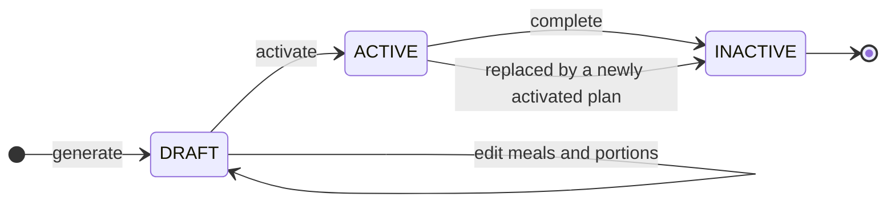
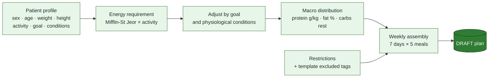
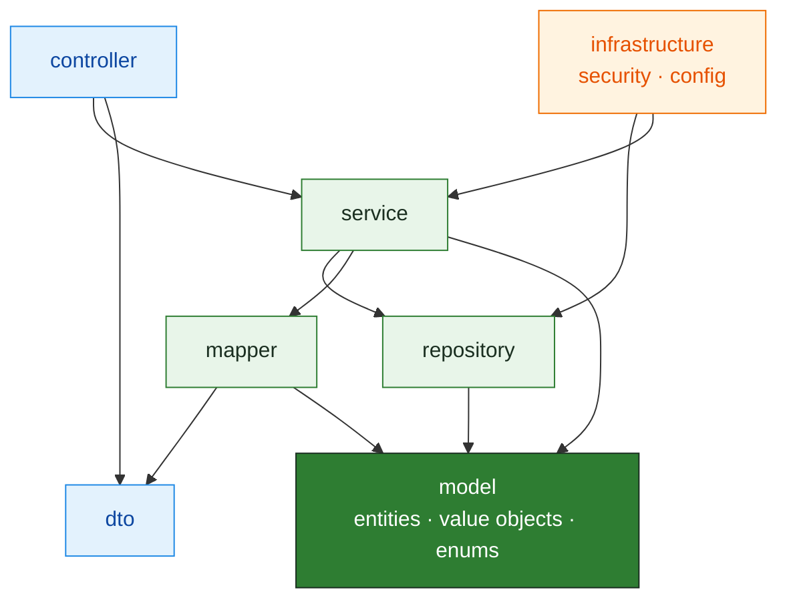
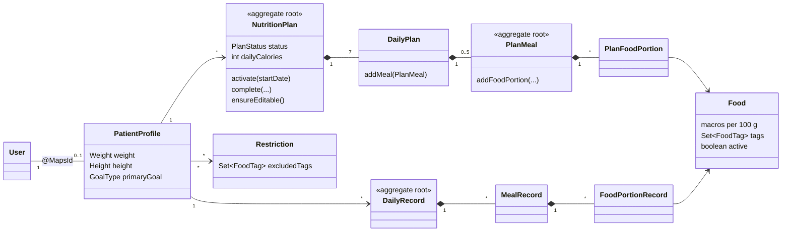
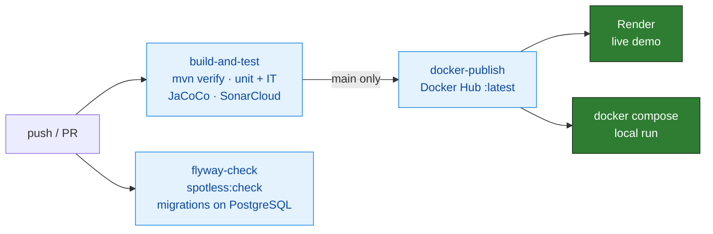

<p align="center">
  <picture>
    <source media="(prefers-color-scheme: dark)" srcset="nutrition/docs/images/lirium-logo-dark.svg">
    
  </picture>
</p>

<h3 align="center">A nutritionist's backend that turns a patient profile into a complete, restriction-safe weekly meal plan — and measures whether the patient actually follows it.</h3>

<p align="center">
  <a href="https://sonarcloud.io/summary/new_code?id=RodolfoAgosto_lirium-nutrition-planning"></a>
  <a href="https://sonarcloud.io/summary/new_code?id=RodolfoAgosto_lirium-nutrition-planning"></a>
  <a href="https://sonarcloud.io/summary/new_code?id=RodolfoAgosto_lirium-nutrition-planning"></a>
  <a href="https://sonarcloud.io/summary/new_code?id=RodolfoAgosto_lirium-nutrition-planning"></a>
  <a href="https://sonarcloud.io/summary/new_code?id=RodolfoAgosto_lirium-nutrition-planning"></a>
  <a href="https://github.com/RodolfoAgosto/lirium-nutrition-planning/actions/workflows/ci.yml"></a>
</p>

<!-- TODO (step 5): uncomment when the demo video is published
<p align="center">
  <a href="VIDEO_URL"></a>
  <br><b>▶ Watch the demo (X min)</b>: a nutritionist generates a plan, the patient records what they ate, adherence is checked.
</p>
-->

## ⚡ Highlights

- 🧮 **Real plan generation engine**: Mifflin-St Jeor energy requirement, goal and physiological adjustments (pregnancy, lactation, menopause), macro distribution, and food selection across **7 days × 5 meals** with daily and weekly variety rules.
- 🛡️ **Restriction-safe by design**: a generated plan never contains a food excluded by the patient's restrictions (gluten-free, lactose-free, low sodium…). This is verified end to end against PostgreSQL.
- 🧱 **DDD aggregates that enforce their own rules**: plan lifecycle, one meal per type per day, no duplicate foods. Services can't bypass them.
- 🔐 **Production-grade security**: JWT access and refresh tokens, Google OAuth2, logout revocation with a Redis blacklist, ownership checks per endpoint.
- ✅ **92% coverage / 82% branches**, 840+ tests, integration tests against **real PostgreSQL** (Testcontainers), and **ArchUnit** architecture rules. SonarCloud Quality Gate passed, with an **A** rating in Security, Reliability and Maintainability.
- 🚀 **CI/CD and deployment**: GitHub Actions → SonarCloud → Docker Hub → Render (app) · Neon (PostgreSQL) · Render Key Value (Redis).
## 🧰 Tech stack

| | |
|---|---|
| **Core** |        |
| **Security** |     |
| **Data** |    -00E599?logo=neon&logoColor=black) | 
| **API & Ops** |    |
| **Testing & quality** |        |
| **DevOps** |     |

## 🚀 Try it

**Live API (Swagger UI):** LIVE_DEMO_URL/swagger-ui.html. The instance sleeps when idle, so the first request can take about a two minutes.

| Role | Email | Password |
|------|-------|----------|
| Nutritionist | `ivana.medina@lirium.com` | `1234` |
| Patient | `ana@test.com` · `juan@test.com` · `maria@test.com` | `1234` |

Log in with `POST /api/auth/login`, paste the access token into **Authorize**, and follow the flow: generate a plan → activate it → record a day → check adherence.

**Run it locally** (Docker only; the published image and the demo data are loaded automatically):

```bash
cd nutrition
docker compose up          # API on http://localhost:8080/swagger-ui.html
./mvnw verify              # full test suite (Docker needed for Testcontainers)
```

## 🩺 What it does

| # | Use case | Actor | Summary |
|---|----------|-------|---------|
| 01 | [Manage nutrition plan](nutrition/docs/use-cases/01-manage-nutrition-plan.md) | Nutritionist | Generate from scratch or from a template, edit meals and portions, activate, complete. |
| 02 | [Record daily intake](nutrition/docs/use-cases/02-record-daily-intake.md) | Patient | Open a day pre-filled from the active plan and adjust it to what was actually eaten. |
| 03 | [Check adherence](nutrition/docs/use-cases/03-check-adherence.md) | Patient / Nutritionist | Recorded vs. expected meals, and consumed vs. planned calories and macros, day by day. |

### Plan lifecycle



A patient has at most one `DRAFT` and one `ACTIVE` plan. Only `DRAFT` plans can be edited or activated. `INACTIVE` plans are never reactivated: a new plan is generated instead.

### Plan generation engine



<details>
<summary><b>Business rules at a glance</b> (click to expand)</summary>

**Generation**
- Basal metabolic rate by Mifflin-St Jeor, multiplied by the activity factor, then adjusted by goal (e.g. −20% weight loss, +15% muscle gain) and by each physiological condition.
- From scratch: protein in g/kg and fat as % of calories, by sex and activity level; carbs take the remaining calories. From a template: the template's protein / carbs / fat split.
- Foods tagged as excluded by any patient restriction, or by the template, are never selected. Inactive foods are never selected.
- Each meal only uses foods suitable for its type, and portions stay within each food's min and max serving.
- Each meal gets its share of the daily budget, and any deviation carries over to the next meal. No food repeats within a day, and each food has a weekly frequency limit.
- An incomplete profile (weight, height, activity, goal, sex, birth date) is rejected with `422`, listing every missing field.

**Editing and lifecycle**
- A day can't have two meals of the same type, and a meal can't contain the same food twice.
- Activating a plan closes the previous `ACTIVE` one (its end date becomes the day before). A failed activation leaves the previous plan untouched.
- Plans created from a template are independent copies: later template changes don't affect them.

**Daily records and adherence**
- One record per patient per date, pre-filled from the active plan. No future dates, and no dates before the plan started.
- Meals can be marked as *overridden* (not eaten as planned). Recorded intake is independent of later plan edits.
- Adherence = recorded meals / expected meals (5 per day), plus a day-by-day comparison of calories and macros against plan targets.

</details>

## 🏗️ Architecture

Layered Spring Boot application with a **DDD-style domain model**: aggregates own their invariants, value objects (`Weight`, `Height`, `Calories`, `MacroDistribution`…) replace primitives, and services orchestrate.



These dependency rules are **enforced by [ArchUnit](nutrition/src/test/java/com/lirium/nutrition/ArchitectureTest.java)**: nothing depends on controllers, and the service and repository layers can only be reached from the allowed layers. Security beans don't depend on services, and naming and packaging conventions are checked on every build.

### Domain model



Full class diagram with fields, value objects and enums: **[docs/architecture.md](docs/architecture.md)**.

## ✅ Quality

| Metric | Value |
|--------|-------|
| JaCoCo coverage, merged (unit + integration) | **92% instructions · 82% branches** |
| Unit tests | 89% · 77% |
| Integration tests | 80% · 58% |
| Tests | 840+ (unit, `@DataJpaTest` repositories, full-context integration, ArchUnit) |
| SonarCloud | Quality Gate **Passed** · **A** Security · **A** Reliability · **A** Maintainability · 0.5% duplication |

- **Real database in tests**: Testcontainers with PostgreSQL 16 (the same image as production). The schema is built by the production Flyway migrations with `ddl-auto=validate`, so any drift between entities and schema fails the build.
- **The engine is tested end to end**: plan generation runs against PostgreSQL with the demo data, including the rule that no excluded food ever appears in a plan.
- **Consistent style**: Spotless with google-java-format, checked in CI.

## 🔄 CI/CD



## 🧭 Design decisions

**Business rules inside the aggregate.** `NutritionPlan.activate()` / `complete()` enforce the lifecycle; `DailyPlan.addMeal()` rejects a second meal of the same type; `PlanMeal` rejects a duplicate food. Some of these rules used to live in services that could skip them. Moving them into the aggregate exposed plan reactivation, which left plans with an end date before their start date, and led to its removal.

**Testcontainers instead of H2.** After the migration, three tests failed. They asserted the order of a patient's plans, and **H2 and PostgreSQL sort `NULL` differently in `ORDER BY … DESC`**: the tests were checking an order that never happened in production. The suite now runs against the real engine and the real migrations.

**The token blacklist fails open.** Logout revokes the refresh token and blacklists the access token's `jti` in Redis, with a TTL equal to its remaining lifetime. If Redis is unreachable, valid tokens are accepted instead of every request being rejected. A logged-out token living until it expires is a smaller risk than a full API outage whenever Redis hiccups.

**`patientId = userId` (`@MapsId`).** `PatientProfile` shares its primary key with `User`: no second id to map or leak, and ownership checks (`#patientId == authentication.principal.id`) compare a single value.

**Errors are part of the API.** A global exception handler maps every failure to a consistent `ApiError` body with the right status: `404` not found, `409` conflicts (duplicate draft, duplicate meal type), `422` domain rule violations, and validation messages that name the offending field.

## 🔐 Security

- Stateless **JWT** access tokens (8 h) with **refresh tokens** (7 days), revoked on logout.
- **Google OAuth2** login, exchanged for JWTs through a short-lived, one-time authorization code.
- Two authorization layers: URL rules in the `SecurityFilterChain`, and `@PreAuthorize` per endpoint with **ownership checks**, so a patient only reaches their own profile, plans and records.
- Roles `ADMIN`, `NUTRITIONIST` and `PATIENT`, built from granular authorities (`plan.write`, `record.read`…). Passwords hashed with BCrypt. CORS restricted to configured origins.

## 📈 Observability

- **Spring Boot Actuator**: `/actuator/health` is public for the platform's health checks; details and other endpoints require `ADMIN`.
- **Request logging interceptor** and profile-specific Logback configuration (`dev` / `prod`).
- **JPA auditing**: creation and update timestamps, plus `createdBy` / `updatedBy` on the main entities (users, profiles, plans, templates, daily records), are filled in automatically.

## 📁 Project structure

```
nutrition/src/main/java/com/lirium/nutrition
├── controller       REST endpoints (OpenAPI-documented)
├── service          use cases and the plan generation engine
├── model            entities (aggregates), value objects, enums
├── repository       Spring Data JPA
├── infrastructure   security (JWT, OAuth2, blacklist), configuration
├── dto · mapper     API contracts and MapStruct mappers
└── exception        domain exceptions and global error handling
```

---

<p align="center">
  <b>Rodolfo Agosto</b>: Java backend developer · Systems Engineer · Oracle Certified Associate (OCA)
  <!-- TODO: <br><a href="LINKEDIN_URL">LinkedIn</a> · <a href="PORTFOLIO_URL">Portfolio</a> -->
</p>