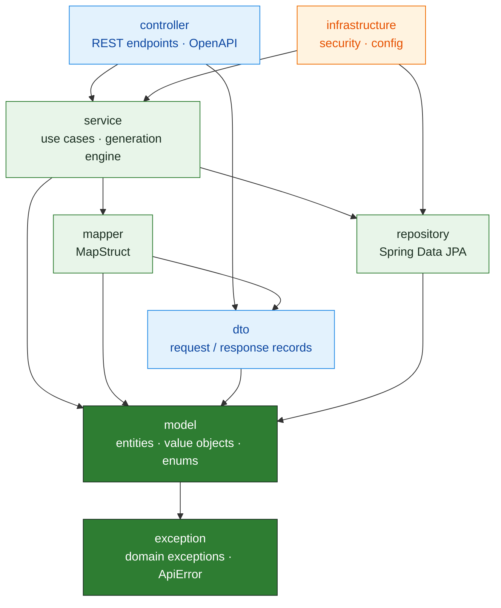
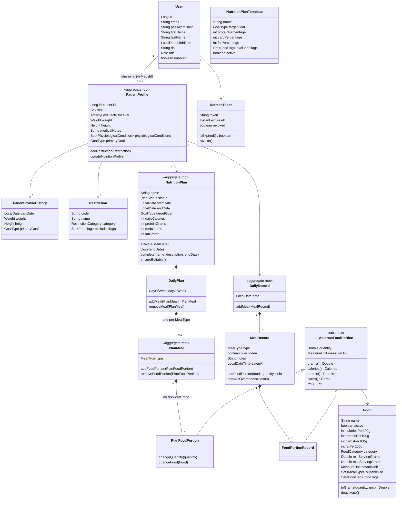
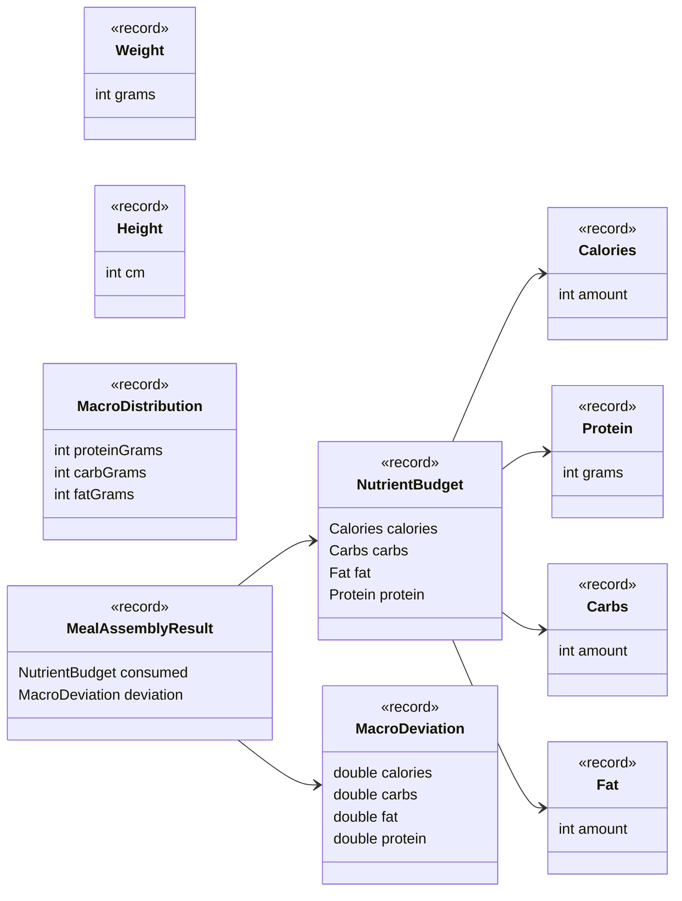

# Architecture

[← Back to README](../README.md)

## Package dependencies

Each package depends only on the ones below it. The rules are enforced by [`ArchitectureTest`](../nutrition/src/test/java/com/lirium/nutrition/ArchitectureTest.java) (ArchUnit) on every build.

| Rule (ArchUnit) | What it guarantees |
|---|---|
| Layered architecture | No layer depends on `controller`. `service` is reached only from `controller` and `infrastructure`. `repository` is reached only from `service` and `infrastructure`. |
| Security beans don't depend on services | Ownership checks (`*Security`) query repositories directly, so `@PreAuthorize` never triggers business logic. |
| Controllers | `@RestController` classes live in `..controller..` and end with `Controller`. |
| Services | `*ServiceImpl` classes live in `..service.impl..` and implement their `*Service` interface. |
| Repositories | Everything in `..repository..` is an interface. |

`exception` is used by most layers (domain exceptions are thrown from the model and translated to HTTP by the global handler). Its arrows are omitted from the diagram, except the one from `model`, for readability.

## Domain model

Aggregate roots are marked `<<aggregate root>>`. Value objects are Java `record`s embedded with `@Embedded`.

### Value objects

`NutrientBudget`, `MacroDeviation` and `MealAssemblyResult` carry the engine's state from meal to meal: each meal consumes part of the daily budget, and its deviation carries over to the next meal.

### Enums

| Enum | Values |
|---|---|
| `PlanStatus` | `DRAFT`, `ACTIVE`, `INACTIVE` |
| `GoalType` | `WEIGHT_LOSS`, `MUSCLE_GAIN`, `WEIGHT_MAINTENANCE`, `METABOLIC_HEALTH`, `PREGNANCY_HEALTH`, `LACTATION_HEALTH` |
| `ActivityLevel` | `SEDENTARY`, `MODERATE`, `ACTIVE`, `VERY_ACTIVE` |
| `PhysiologicalCondition` | `PREGNANCY`, `LACTATION`, `MENOPAUSE` |
| `MealType` | `BREAKFAST`, `MID_MORNING`, `LUNCH`, `SNACK`, `DINNER` |
| `FoodCategory` | `PROTEIN`, `CARB`, `DAIRY`, `VEGETABLE`, `FRUIT`, `SWEET`, `FAT`, `BEVERAGE` |
| `FoodTag` | `GLUTEN`, `LACTOSE`, `MEAT`, `FISH`, `EGG`, `HONEY`, `GELATIN`, `NUTS`, `SOY`, `ALCOHOL`, `LEGUME`, `HIGH_PROTEIN` |
| `RestrictionCategory` | `PATHOLOGICAL`, `INTOLERANCES`, `DIETARY` |
| `Role` | `PATIENT`, `NUTRITIONIST`, `ADMIN` |

A `Restriction` excludes a set of `FoodTag`s. The generator never selects a `Food` carrying any of them.